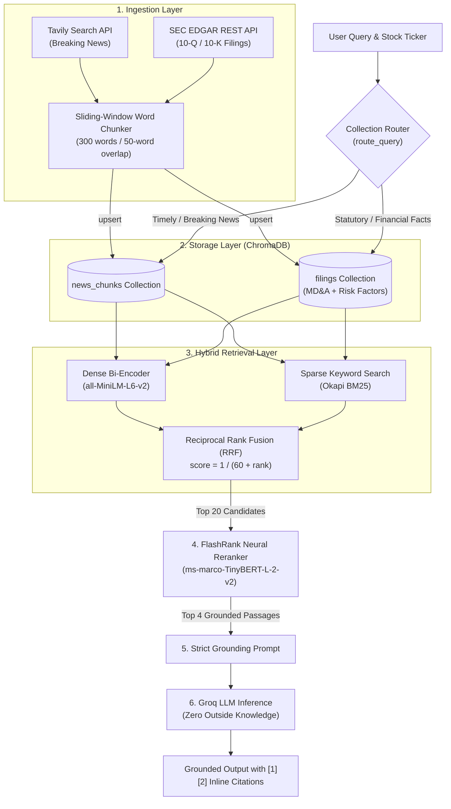

# StockSage 📈

[](https://github.com/sugam24/STOCKSAGE/actions/workflows/ci.yml)
[](https://fastapi.tiangolo.com)
[](https://streamlit.io)
[](https://langchain-ai.github.io/langgraph/)
[](https://www.python.org/)

**An institutional-grade, multi-agent AI financial research platform** combining real-time market data, statutory SEC EDGAR filings (10-Q/10-K), news intelligence, hybrid retrieval (Dense + BM25 with Reciprocal Rank Fusion), neural cross-encoder reranking, and citation-grounded LLM synthesis.

Built as a 75-day progressive engineering journey. This repository currently features **Phase 1 (Foundations)** and **Phase 2 (RAG & Retrieval Architecture)** across **Days 1–30**.

---

## Table of Contents

- [Overview & Architecture](#overview--architecture)
- [Key Features](#key-features)
- [Phase 2: RAG Deep Dive (Days 16–30)](#phase-2-rag-deep-dive-days-1630)
- [Project Directory Structure](#project-directory-structure)
- [Prerequisites & Environment Setup](#prerequisites--environment-setup)
- [Installation](#installation)
- [Quickstart: Running StockSage](#quickstart-running-stocksage)
  - [1. Flagship News RAG Agent (Day 30 Checkpoint)](#1-flagship-news-rag-agent-day-30-checkpoint)
  - [2. Multi-Collection RAG Pipeline (News vs. Filings)](#2-multi-collection-rag-pipeline-news-vs-filings)
  - [3. Interactive Financial Chatbot](#3-interactive-financial-chatbot)
  - [4. Individual Runnable Modules](#4-individual-runnable-modules)
- [Evaluation & Benchmarking (Days 27–29)](#evaluation--benchmarking-days-2729)
- [Test Suite](#test-suite)
- [Curriculum & Roadmap](#curriculum--roadmap)
- [Tech Stack](#tech-stack)
- [License](#license)

---

## Overview & Architecture

Standard LLMs suffer from knowledge cutoffs, stale training data, and hallucinations—unacceptable traits when making investment decisions. **StockSage** solves this through a deterministic, cited, multi-collection retrieval-augmented generation (RAG) architecture that separates timely market catalysts from authoritative statutory corporate filings.



---

## Key Features

* **Dual-Source Ingestion**:
  * **SEC EDGAR Integration (Day 25)**: Direct REST API connector extracting plain text, **MD&A (Management Discussion & Analysis)**, and **Risk Factors** directly from official 10-Q/10-K filings without third-party paywalls.
  * **Tavily Financial News (Day 11 & 19)**: Real-time news search with 30-day temporal filtering.
* **Intelligent Multi-Collection Query Routing (Day 26)**:
  * Automatically routes timely queries ("latest", "today", "breaking") to `news_chunks`.
  * Routes quantitative and statutory queries ("revenue last quarter", "margin") to official SEC `filings`.
  * Includes confidence-score fallback to query secondary collections when primary relevance is borderline.
* **Hybrid Search with Reciprocal Rank Fusion (Days 21 & 22)**:
  * Combines semantic embeddings (`all-MiniLM-L6-v2`) with exact-keyword lexical matching (`rank-bm25`).
  * Normalizes and merges disparate score distributions using rank-based RRF ($k = 60$).
* **Cross-Encoder Neural Reranking (Day 23)**:
  * Ultra-fast local CPU reranker (`flashrank` / `ms-marco-TinyBERT-L-2-v2`) computing full cross-attention over `(query, passage)` pairs to eliminate first-stage retrieval noise.
* **Strict Source Grounding & Attribution (Day 24)**:
  * Enforces zero-hallucination system constraints; requires the LLM to provide verified inline citations (`[1]`, `[2]`).
* **Empirical Golden Evaluation Benchmark (Days 27–29)**:
  * Evaluated against 15 hand-curated institutional financial questions across `NVDA`, `AAPL`, and `TSLA`.
  * Documented optimization improving retrieval hit rate from **86.7% (13/15)** to **100% (15/15)**.
* **Phase 1 Foundations Retained**:
  * Real-time fundamentals & price history via `yfinance`.
  * Wilder's RSI (14-period) and SMA-20 / SMA-50 technical indicators computed from scratch using pandas.
  * Resilient LLM client with streaming, exponential backoff retries, and Pydantic function calling.

---

## Phase 2: RAG Deep Dive (Days 16–30)

| Day | Focus | Implementation | Key Deliverable |
|:---|:---|:---|:---|
| **Day 16** | RAG Fundamentals | [`docs/concepts/rag.md`](docs/concepts/rag.md) | Conceptual architecture and interview-ready RAG mental model. |
| **Day 17** | Dense Embeddings | [`src/rag/embeddings.py`](src/rag/embeddings.py) | Local CPU embedding generation (`all-MiniLM-L6-v2`) with verified hand-calculated cosine similarity. |
| **Day 18** | Vector Database | [`src/rag/vectorstore.py`](src/rag/vectorstore.py) | Persistent local ChromaDB store in `data/chroma/` with cosine distance space and idempotent upserts. |
| **Day 19** | News Retriever | [`src/rag/retriever.py`](src/rag/retriever.py) | Connects Tavily search into ChromaDB with metadata isolation (ticker, URL, published date). |
| **Day 20** | Document Chunking | [`src/rag/chunker.py`](src/rag/chunker.py) | Sliding-window word-level chunker (300 words, 50-word overlap) preserving financial data across boundaries. |
| **Day 21** | BM25 Keyword Search | [`src/rag/bm25.py`](src/rag/bm25.py) | Okapi BM25 keyword index with specialized financial tokenization (handling punctuation, tickers, numbers). |
| **Day 22** | Hybrid Search (RRF) | [`src/rag/hybrid.py`](src/rag/hybrid.py) | Reciprocal Rank Fusion ($score = \sum \frac{1}{60 + rank}$) merging embedding and BM25 results. |
| **Day 23** | Cross-Encoder Reranking | [`src/rag/reranker.py`](src/rag/reranker.py) | FlashRank cross-attention model pruning noisy candidates down to the top relevant passages. |
| **Day 24** | Full RAG Pipeline | [`src/rag/pipeline.py`](src/rag/pipeline.py) | Async end-to-end pipeline: index on-demand ➔ hybrid search ➔ rerank ➔ context format ➔ Groq generation with citations. |
| **Day 25** | SEC EDGAR Ingestion | [`src/ingestion/edgar_client.py`](src/ingestion/edgar_client.py) | SEC JSON API client fetching 10-Q filings, parsing HTML, extracting MD&A + Risk Factors into ChromaDB `filings`. |
| **Day 26** | Multi-Collection Retrieval | [`src/rag/retriever.py`](src/rag/retriever.py) | `route_query()` intelligently directs questions to `filings` or `news_chunks` with cross-collection fallback. |
| **Day 27** | Golden Evaluation Dataset | [`evaluation/golden_dataset.json`](evaluation/golden_dataset.json) | 15 ground-truth institutional questions across NVDA, AAPL, and TSLA with known source snippets and facts. |
| **Day 28** | RAG Evaluation Harness | [`evaluation/evaluate.py`](evaluation/evaluate.py), [`evaluation/report.md`](evaluation/report.md) | Baseline benchmark run measuring 13/15 (86.7%) precision on the golden dataset. |
| **Day 29** | Retrieval Tuning | [`src/rag/pipeline.py`](src/rag/pipeline.py) | Tuned candidate depth ($k=10 \rightarrow 20$) and rerank cutoff ($top\_n=3 \rightarrow 4$), achieving **15/15 (100%)** accuracy. |
| **Day 30** | Phase 2 News Agent | [`src/rag/news_agent.py`](src/rag/news_agent.py), [`docs/phase2_notes.md`](docs/phase2_notes.md) | Multi-ticker research agent checkpoint and comprehensive Phase 2 retrospective documentation. |

---

## Project Directory Structure

```
StockSage/
├── .env                          # Local secrets (API keys - git-ignored)
├── .env.example                  # Environment template
├── .gitignore                    # Git ignore rules (includes data/, .venv/, etc.)
├── pyproject.toml                # Project metadata, dependencies, and test configurations
├── README.md                     # Comprehensive project documentation
├── uv.lock                       # Deterministic dependency lockfile
│
├── src/                          # Application source code
│   ├── __init__.py
│   ├── chat.py                   # Day 3  — Multi-turn financial CLI chatbot
│   ├── pipeline.py               # Day 15 — Phase 1 end-to-end integration script
│   │
│   ├── core/                     # LLM client, schemas, and tool calling
│   │   ├── __init__.py
│   │   ├── config.py             # Day 1  — Pydantic BaseSettings for environment variables
│   │   ├── schema.py             # Day 4  — Core Pydantic schemas (StockData, etc.)
│   │   ├── structured.py         # Day 5  — Function-calling structured extraction
│   │   ├── tool_calling.py       # Day 6  — Single-tool execution demo
│   │   ├── tools.py              # Day 7  — Reusable ToolDispatcher agent loop
│   │   └── llm/
│   │       ├── __init__.py
│   │       └── client.py         # Day 2, 12, 13 — Groq client with streaming & backoff retries
│   │
│   ├── ingestion/                # External data source connectors
│   │   ├── __init__.py
│   │   ├── edgar_client.py       # Day 25 — SEC EDGAR 10-Q/10-K filing parser & indexer
│   │   ├── explore_pandas.py     # Day 9  — Pandas data exploration
│   │   ├── explore_yfinance.py   # Day 8  — yfinance API exploration
│   │   ├── tavily_client.py      # Day 11 — Tavily financial news search client
│   │   ├── technical.py          # Day 10 — Wilder's RSI, SMA-20, SMA-50 technical engine
│   │   └── yfinance_client.py    # Day 8  — Validated stock fundamentals & price history
│   │
│   ├── rag/                      # Phase 2: RAG & Information Retrieval Engine
│   │   ├── __init__.py
│   │   ├── bm25.py               # Day 21 — Okapi BM25 lexical keyword search
│   │   ├── chunker.py            # Day 20 — 300-word / 50-word overlap document chunker
│   │   ├── embeddings.py         # Day 17 — Local sentence-transformers embedding generator
│   │   ├── hybrid.py             # Day 22 — Reciprocal Rank Fusion (RRF) search merger
│   │   ├── news_agent.py         # Day 30 — Phase 2 Checkpoint: Multi-ticker News RAG agent
│   │   ├── pipeline.py           # Day 24, 29 — Async end-to-end multi-collection RAG pipeline
│   │   ├── reranker.py           # Day 23 — FlashRank neural cross-encoder reranker
│   │   ├── retriever.py          # Day 19, 26 — Semantic retriever with collection routing
│   │   └── vectorstore.py        # Day 18 — Persistent ChromaDB vector store wrapper
│   │
│   ├── agents/                   # Phase 3: LangGraph multi-agent system (Upcoming)
│   ├── graph/                    # Phase 3: Agent state graph and routing (Upcoming)
│   └── api/                      # Phase 4: FastAPI endpoints (Upcoming)
│
├── evaluation/                   # RAG Evaluation Suite & Golden Benchmarks
│   ├── build_snapshot.py         # Day 27 — Snapshot builder freezing corpus for reproducible evals
│   ├── corpus_snapshot.json      # Day 27 — Frozen corpus of news and SEC filings for NVDA, AAPL, TSLA
│   ├── evaluate.py               # Day 28, 29 — Automated evaluation execution harness
│   ├── golden_dataset.json       # Day 27 — 15 ground-truth institutional benchmark questions
│   └── report.md                 # Day 28, 29 — Quantitative evaluation report & tuning analysis
│
├── tests/                        # Automated Test Suite (60+ unit and integration tests)
│   ├── __init__.py
│   ├── test_rag.py               # Days 20–22 — Unit tests for chunker, BM25 tokenizer, and RRF
│   ├── test_schema.py            # Day 14 — Schema validation tests
│   ├── test_structured.py        # Day 14 — Function-calling extraction tests
│   ├── test_technical.py         # Day 14 — Hand-calculated RSI & Moving Average tests
│   ├── test_tools.py             # Day 14 — ToolDispatcher and loop safety tests
│   └── test_yfinance_client.py   # Day 14 — Yahoo Finance data model validation tests
│
└── docs/                         # Architecture documentation and retrospectives
    ├── phase1_notes.md           # Day 15 — Phase 1 retrospective & reference guide
    ├── phase2_notes.md           # Day 30 — Phase 2 architecture retrospective & lessons learned
    └── concepts/
        ├── rag.md                # Day 16 — Plain-English explanation of RAG
        └── ...
```

---

## Prerequisites & Environment Setup

* **Python 3.12+**
* **[uv](https://docs.astral.sh/uv/)** (recommended: ultra-fast Python package and project manager) or standard `pip`
* **Free API Keys**:
  * [Groq Cloud Console](https://console.groq.com/) — Free LLM inference.
  * [Tavily AI](https://tavily.com/) — 1,000 free monthly agentic search queries.
  * *(Optional)* SEC EDGAR requires no API key, but a custom `SEC_USER_AGENT` header can be specified in `.env`.

---

## Installation

### 1. Clone the repository
```bash
git clone https://github.com/sugam24/STOCKSAGE.git
cd STOCKSAGE
```

### 2. Install dependencies
Using **uv** (recommended):
```bash
uv sync --all-groups
```
*Or using standard pip and virtual environment:*
```bash
python3 -m venv .venv
source .venv/bin/activate       # On Linux/macOS
# .venv\Scripts\activate        # On Windows
pip install -e ".[dev]"
```

### 3. Configure Environment Variables
Copy `.env.example` to create your local `.env` file:
```bash
cp .env.example .env
```
Fill in your credentials:
```env
GROQ_API_KEY=gsk_your_groq_api_key_here
TAVILY_API_KEY=tvly-your_tavily_api_key_here

# Optional overrides:
# GROQ_MODEL=openai/gpt-oss-120b
# SEC_USER_AGENT=StockSage research your_email@domain.com
```

---

## Quickstart: Running StockSage

### 1. Flagship News RAG Agent (Day 30 Checkpoint)
Runs the complete RAG research flow (fetch fresh news ➔ chunk ➔ hybrid retrieve ➔ cross-encoder rerank ➔ grounded synthesis):

```bash
# Analyze a single stock
uv run python -m src.rag.news_agent NVDA

# Run across all primary benchmark tickers (NVDA, AAPL, TSLA)
uv run python -m src.rag.news_agent --all
```

### 2. Multi-Collection RAG Pipeline (News vs. Filings)
Run queries through the intelligent multi-collection router:

```bash
# Statutory/factual question (automatically routes to SEC 10-Q filings):
uv run python -m src.rag.pipeline NVDA "What was NVDA's Data Center revenue last quarter?"

# Breaking market catalyst question (automatically routes to Tavily news):
uv run python -m src.rag.pipeline NVDA "What are the latest breaking news stories on NVDA?"

# Force refresh from live web:
uv run python -m src.rag.pipeline AAPL "What are Apple's main supply chain risks?" --refresh
```

### 3. Interactive Financial Chatbot
Launch the multi-turn conversational terminal interface with strict financial persona safeguards:

```bash
uv run python -m src.chat
```

### 4. Individual Runnable Modules
Every module is completely self-contained with CLI smoke tests:

| Module | Command | What It Runs |
|:---|:---|:---|
| **Phase 2 News Agent** | `uv run python -m src.rag.news_agent NVDA` | Full research flow for a ticker |
| **RAG Pipeline** | `uv run python -m src.rag.pipeline NVDA` | Hybrid search + FlashRank rerank + citations |
| **Collection Router** | `uv run python -m src.rag.retriever --route NVDA` | Side-by-side filings vs. news routing demo |
| **SEC EDGAR Ingestion** | `uv run python -m src.ingestion.edgar_client NVDA` | Ingests latest 10-Q MD&A & Risk Factors |
| **FlashRank Reranker** | `uv run python -m src.rag.reranker NVDA` | Cross-encoder precision scoring demo |
| **Hybrid Search** | `uv run python -m src.rag.hybrid NVDA` | Compares Embedding vs. BM25 vs. RRF |
| **BM25 Keyword Search** | `uv run python -m src.rag.bm25 NVDA` | Lexical keyword search over stored chunks |
| **Document Chunker** | `uv run python -m src.rag.chunker` | 300-word / 50-overlap sliding window demo |
| **ChromaDB Vector Store**| `uv run python -m src.rag.vectorstore` | Upsert and semantic similarity query |
| **Local Embeddings** | `uv run python -m src.rag.embeddings` | Encodes sentences with `all-MiniLM-L6-v2` |
| **Phase 1 Pipeline** | `uv run python -m src.pipeline` | Fundamentals + technical indicators + summary |
| **Technical Indicators** | `uv run python -m src.ingestion.technical` | Calculates Wilder's RSI and Moving Averages |
| **yfinance Client** | `uv run python -m src.ingestion.yfinance_client` | Pydantic-validated fundamentals & prices |
| **Tavily News Client** | `uv run python -m src.ingestion.tavily_client` | Searches and filters recent 30-day news |

---

## Evaluation & Benchmarking (Days 27–29)

To ensure StockSage delivers verifiable institutional accuracy, the retrieval pipeline is continuously benchmarked against a hand-curated dataset of 15 golden questions across 3 major public equities (`NVDA`, `AAPL`, `TSLA`).

```bash
# Run the automated golden dataset benchmark
uv run python -m evaluation.evaluate
```

### Benchmark Results Progression

```
Day 28 Baseline:  [██████████████████████████░░░░]  13/15 Passed (86.7%)
Day 29 Optimized: [██████████████████████████████]  15/15 Passed (100.0%)
```

* **Root-Cause Failure Analysis (Day 28)**:
  * `q10` (Apple 52-week & YTD price gains) missed the top-3 cutoff because multiple competing valuation paragraphs pushed the target passage to rank #4.
  * `q12` (Tesla consumer vehicle production/deliveries) was excluded from FlashRank because high-frequency keyword terms in financial tables displaced the introductory narrative from the initial 10-candidate pool.
* **Engineering Optimizations (Day 29)**:
  1. **Candidate Pool Expansion**: Increased hybrid candidate depth before RRF from $k=10$ to $k=20$.
  2. **Reranker Window Expansion**: Increased prompt context window from $top\_n=3$ to $top\_n=4$ chunks (~1,200 words), keeping token budgets lean while eliminating boundary cutoff.
* Full diagnostic documentation available in [`evaluation/report.md`](evaluation/report.md).

---

## Test Suite

StockSage enforces automated test coverage across schemas, mathematics, data clients, tool dispatch, and RAG operations.

```bash
# Run all unit tests (fully offline, no external API calls required)
uv run pytest -v -m "not integration"

# Run the RAG component test suite
uv run pytest tests/test_rag.py -v

# Run the complete test suite (including live integration tests)
uv run pytest -v
```

### Test Coverage Summary

| Test File | Focus Area | Offline Unit Tests |
|:---|:---|:---:|
| `test_rag.py` | Chunker boundary overlap, BM25 tokenization, RRF rank fusion mathematics | ✅ |
| `test_technical.py` | Hand-calculated Wilder's RSI verification, MA edge cases | ✅ |
| `test_schema.py` | Pydantic model validation, invalid type rejections | ✅ |
| `test_structured.py` | Groq function-calling JSON schema generation, object extraction | ✅ |
| `test_tools.py` | Agent tool dispatcher, duplicate handling, infinite-loop caps | ✅ |
| `test_yfinance_client.py`| Market data schemas (CompanyFundamentals, PriceBar, PriceHistory) | ✅ |

---

## Curriculum & Roadmap

StockSage is structured as a 75-day progressive masterclass divided into 5 phases:

```
[Phase 1: Foundations] ➔ [Phase 2: RAG Engine] ➔ [Phase 3: Multi-Agent] ➔ [Phase 4: Deployment] ➔ [Phase 5: Production]
      (Days 1–15)             (Days 16–30)            (Days 31–50)           (Days 51–65)           (Days 66–75)
      ✅ COMPLETE             ✅ COMPLETE             🔲 UPCOMING            🔲 UPCOMING            🔲 UPCOMING
```

| Phase | Days | Focus Area | Status |
|:---|:---:|:---|:---:|
| **Phase 1: Foundations** | 1–15 | Groq LLM client, Pydantic validation, yfinance, technical analysis, Tavily search | ✅ **Complete** |
| **Phase 2: RAG Architecture** | 16–30 | Embeddings, ChromaDB, chunking, BM25, hybrid search (RRF), FlashRank reranking, SEC EDGAR, golden benchmarks | ✅ **Complete** |
| **Phase 3: Multi-Agent System** | 31–50 | LangGraph orchestration, Data Agent, News Agent, Risk Agent (VaR/Drawdown), Analyst Agent, Supervisor routing, Human-in-the-Loop gates | 🔲 Upcoming |
| **Phase 4: Deployment & UI** | 51–65 | FastAPI backend, WebSocket streaming, Streamlit dashboard, Plotly charts, Docker & Compose, CI/CD, LangSmith tracing | 🔲 Upcoming |
| **Phase 5: Production & Polish**| 66–75 | Cloud deployment, public URLs, latency/cost optimization, interview walkthroughs | 🔲 Upcoming |

---

## Tech Stack

| Component | Technology | Purpose |
|:---|:---|:---|
| **Language & Runtime** | Python 3.12+ | High-performance modern Python |
| **Package Management** | [uv](https://docs.astral.sh/uv/) | Fast, deterministic dependency resolution |
| **LLM Inference** | [Groq](https://groq.com/) | Low-latency inference (`llama-3.3-70b-versatile`, `openai/gpt-oss-120b`) |
| **Dense Embeddings** | [Sentence-Transformers](https://sbert.net/) | Local semantic representations via `all-MiniLM-L6-v2` |
| **Vector Database** | [ChromaDB](https://trychroma.com/) | Persistent local vector store with cosine distance |
| **Sparse Keyword Search** | [rank-bm25](https://pypi.org/project/rank-bm25/) | Okapi BM25 exact lexical matching |
| **Cross-Encoder Reranking**| [FlashRank](https://pypi.org/project/flashrank/) | Lightweight CPU cross-encoder (`ms-marco-TinyBERT-L-2-v2`) |
| **Statutory Filings** | [SEC EDGAR API](https://efts.sec.gov/) | Official 10-Q & 10-K regulatory filings |
| **HTML Parsing** | [BeautifulSoup4](https://www.crummy.com/software/BeautifulSoup/) | Robust cleaning of corporate filing markup |
| **Market Data Engine** | [yfinance](https://github.com/ranaroussi/yfinance) | Real-time equity fundamentals and historical OHLCV series |
| **Data Analysis** | [pandas](https://pandas.pydata.org/), [numpy](https://numpy.org/) | Financial time-series modeling & indicator computation |
| **Search Intelligence** | [Tavily](https://tavily.com/) | Real-time AI agent web search API |
| **Data Validation** | [Pydantic v2](https://docs.pydantic.dev/) | Strict runtime data validation and schema enforcement |
| **Testing** | [pytest](https://pytest.org/) | Automated test suite (unit and live integration) |
| **Static Typing** | [pyright](https://github.com/microsoft/pyright) | Strict type checking and IDE intellisense |

---

## License

This project is developed for educational and portfolio demonstration purposes. Open source under the MIT License.
