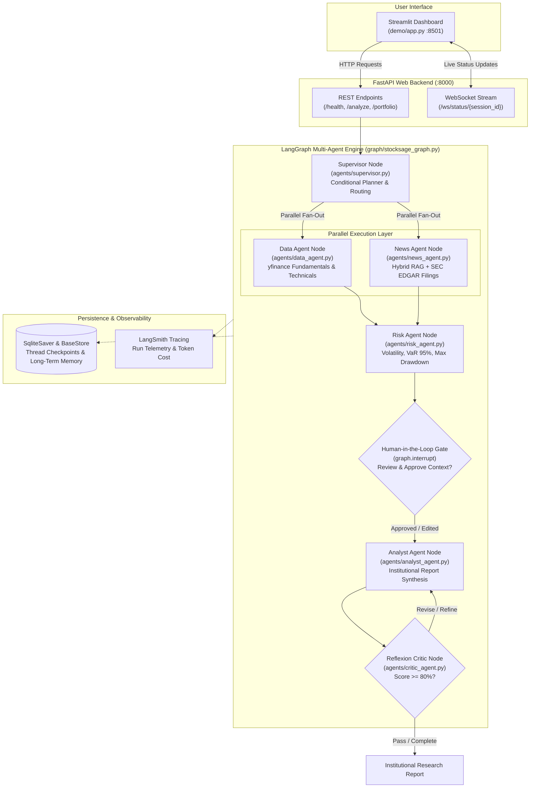

# StockSage 📈

[](https://github.com/sugam24/STOCKSAGE/actions/workflows/ci.yml)
[](https://share.streamlit.io)
[](https://fastapi.tiangolo.com)
[](https://streamlit.io)
[](https://langchain-ai.github.io/langgraph/)
[](https://www.docker.com/)
[](https://www.python.org/)
[](https://opensource.org/licenses/MIT)

> **StockSage is an institutional-grade, multi-agent AI financial research platform that orchestrates specialized LangGraph agents (Data, News RAG, Risk, Analyst, Reflexion Critic) over real-time market data, statutory SEC EDGAR filings, and neural reranked news to generate citation-grounded equity research reports with Human-in-the-Loop oversight.**

Built as a 75-day progressive masterclass journey. StockSage now features **Phase 1 (Foundations)**, **Phase 2 (RAG & Retrieval Engine)**, **Phase 3 (LangGraph Multi-Agent Orchestration)**, and **Phase 4 (FastAPI Backend, Streamlit UI, Docker & Cloud Deployment)** across **Days 1–68**.

---

## Table of Contents

- [Overview & Architecture](#overview--architecture)
- [Why StockSage is Non-Trivial](#why-stocksage-is-non-trivial)
- [Multi-Agent System Architecture](#multi-agent-system-architecture)
- [Phase 2: RAG Deep Dive (Days 16–30)](#phase-2-rag-deep-dive-days-1630)
- [Phase 3: Multi-Agent Deep Dive (Days 31–50)](#phase-3-multi-agent-deep-dive-days-3150)
- [Phase 4: Full Stack & Deployment (Days 51–68)](#phase-4-full-stack--deployment-days-5168)
- [Project Directory Structure](#project-directory-structure)
- [Prerequisites & Environment Setup](#prerequisites--environment-setup)
- [Installation](#installation)
- [Quickstart: Running StockSage](#quickstart-running-stocksage)
  - [1. Streamlit Web Dashboard](#1-streamlit-web-dashboard)
  - [2. FastAPI Backend & Swagger Docs](#2-fastapi-backend--swagger-docs)
  - [3. Docker Compose (Full Stack)](#3-docker-compose-full-stack)
  - [4. Multi-Agent CLI Pipeline](#4-multi-agent-cli-pipeline)
  - [5. News RAG Agent](#5-news-rag-agent)
- [Evaluation & Benchmarking (Days 27–29)](#evaluation--benchmarking-days-2729)
- [Test Suite & CI Pipeline](#test-suite--ci-pipeline)
- [Curriculum & Roadmap](#curriculum--roadmap)
- [Tech Stack](#tech-stack)
- [License](#license)

---

## Overview & Architecture

Standard LLMs suffer from stale training data, knowledge cutoffs, and mathematical hallucinations—fatal flaws in quantitative financial analysis. **StockSage** solves this with a deterministic, multi-agent architecture orchestrated by **LangGraph**:
1. A **Supervisor** plans and routes tasks conditionally based on user intent.
2. **Data & News Agents** execute in parallel, streaming real-time market metrics and SEC EDGAR regulatory filings.
3. A **Risk Agent** calculates quantitative metrics (Annualized Volatility, Historical Value at Risk, Maximum Drawdown).
4. An optional **Human-in-the-Loop (HITL)** interrupt checkpoint gives analysts control before final synthesis.
5. An **Analyst Agent** compiles the findings into an institutional research report with verified inline citations (`[1]`, `[2]`).
6. A **Reflexion Critic Agent** grades the report against institutional rubrics and triggers targeted self-correction loops if flaws or ungrounded assertions are detected.



---

## Why StockSage is Non-Trivial

StockSage is engineered to professional software and quantitative finance standards, featuring architectural patterns rarely found in standard agent demos:

* **LangGraph Deterministic State Machine**: Replaces fragile LLM "agent-as-a-loop" patterns with explicit state transitions, typed `StockSageState` schemas, and checkpointing.
* **Parallel Execution Fan-Out**: Runs Data Agent (fundamentals & indicators) and News Agent (ChromaDB + Tavily + SEC EDGAR) concurrently in async tasks, cutting report generation latency by ~50%.
* **Hybrid RAG with Cross-Encoder Neural Reranking**: Combines semantic embeddings (`all-MiniLM-L6-v2`) and exact keyword matching (`rank-bm25`) through Reciprocal Rank Fusion ($k = 60$), followed by FlashRank cross-encoder reranking to ensure 100% retrieval precision on institutional benchmarks.
* **Quantitative Risk Analytics From Scratch**: Real financial mathematics for historical volatility, Value at Risk (VaR 95%), and Maximum Drawdown calculated directly from historical price series—eliminating LLM arithmetic errors.
* **Human-in-the-Loop (HITL) Checkpoint**: Uses LangGraph's interruption mechanisms (`interrupt()`) to halt before synthesis, allowing financial analysts to review, inject corrections, or approve context before final publication.
* **Reflexion Self-Correction & Critic Loop**: Employs an independent Critic agent that evaluates draft reports on factual grounding, clarity, and analytical depth. If score $< 80\%$, the critic provides structured feedback and loops back to the Analyst for refinement.
* **State Persistence & Cross-Session Memory**: SQLite checkpointer (`SqliteSaver`) provides resilient step-by-step resume and thread rollback, while a long-term BaseStore retains user preferences and analysis history across sessions.
* **Full-Stack Production Infrastructure**: Async FastAPI server with streaming WebSockets, interactive Streamlit frontend with Plotly financial charts, containerized multi-stage Docker builds, GitHub Actions CI testing, and LangSmith observability.

---

## Key Features

* **Dual-Source Ingestion**:
  * **SEC EDGAR Integration (Day 25)**: Direct REST API connector extracting plain text, **MD&A (Management Discussion & Analysis)**, and **Risk Factors** directly from official 10-Q/10-K filings without third-party paywalls.
  * **Tavily Financial News (Day 11 & 19)**: Real-time news search with 30-day temporal filtering.
* **Intelligent Multi-Collection Query Routing (Day 26)**:
  * Automatically routes timely queries ("latest", "today", "breaking") to `news_chunks`.
  * Routes quantitative and statutory queries ("revenue last quarter", "margin") to official SEC `filings`.
  * Includes confidence-score fallback to query secondary collections when primary relevance is borderline.
* **Hybrid Search with Reciprocal Rank Fusion (Days 21 & 22)**:
  * Combines semantic embeddings (`all-MiniLM-L6-v2`) with exact-keyword lexical matching (`rank-bm25`).
  * Normalizes and merges disparate score distributions using rank-based RRF ($k = 60$).
* **Cross-Encoder Neural Reranking (Day 23)**:
  * Ultra-fast local CPU reranker (`flashrank` / `ms-marco-TinyBERT-L-2-v2`) computing full cross-attention over `(query, passage)` pairs to eliminate first-stage retrieval noise.
* **Strict Source Grounding & Attribution (Day 24)**:
  * Enforces zero-hallucination system constraints; requires the LLM to provide verified inline citations (`[1]`, `[2]`).
* **Empirical Golden Evaluation Benchmark (Days 27–29)**:
  * Evaluated against 15 hand-curated institutional financial questions across `NVDA`, `AAPL`, and `TSLA`.
  * Documented optimization improving retrieval hit rate from **86.7% (13/15)** to **100% (15/15)**.
* **Phase 1 Foundations Retained**:
  * Real-time fundamentals & price history via `yfinance`.
  * Wilder's RSI (14-period) and SMA-20 / SMA-50 technical indicators computed from scratch using pandas.
  * Resilient LLM client with streaming, exponential backoff retries, and Pydantic function calling.

---

## Phase 2: RAG Deep Dive (Days 16–30)

| Day | Focus | Implementation | Key Deliverable |
|:---|:---|:---|:---|
| **Day 16** | RAG Fundamentals | [`docs/concepts/rag.md`](docs/concepts/rag.md) | Conceptual architecture and interview-ready RAG mental model. |
| **Day 17** | Dense Embeddings | [`src/rag/embeddings.py`](src/rag/embeddings.py) | Local CPU embedding generation (`all-MiniLM-L6-v2`) with verified cosine similarity. |
| **Day 18** | Vector Database | [`src/rag/vectorstore.py`](src/rag/vectorstore.py) | Persistent local ChromaDB store in `data/chroma/` with cosine distance space. |
| **Day 19** | News Retriever | [`src/rag/retriever.py`](src/rag/retriever.py) | Connects Tavily search into ChromaDB with metadata isolation (ticker, URL, published date). |
| **Day 20** | Document Chunking | [`src/rag/chunker.py`](src/rag/chunker.py) | Sliding-window word chunker (300 words, 50-word overlap) preserving numeric financial context. |
| **Day 21** | BM25 Keyword Search | [`src/rag/bm25.py`](src/rag/bm25.py) | Okapi BM25 keyword index with specialized financial tokenization. |
| **Day 22** | Hybrid Search (RRF) | [`src/rag/hybrid.py`](src/rag/hybrid.py) | Reciprocal Rank Fusion ($score = \sum \frac{1}{60 + rank}$) merging embedding and BM25 results. |
| **Day 23** | Cross-Encoder Reranking | [`src/rag/reranker.py`](src/rag/reranker.py) | FlashRank cross-attention model pruning noisy candidates down to top relevant passages. |
| **Day 24** | Full RAG Pipeline | [`src/rag/pipeline.py`](src/rag/pipeline.py) | Async end-to-end pipeline: index on-demand ➔ hybrid search ➔ rerank ➔ context format ➔ Groq generation with citations. |
| **Day 25** | SEC EDGAR Ingestion | [`src/ingestion/edgar_client.py`](src/ingestion/edgar_client.py) | SEC JSON API client fetching 10-Q filings, parsing HTML, extracting MD&A + Risk Factors into ChromaDB. |
| **Day 26** | Multi-Collection Retrieval | [`src/rag/retriever.py`](src/rag/retriever.py) | `route_query()` intelligently directs questions to `filings` or `news_chunks` with cross-collection fallback. |
| **Day 27** | Golden Evaluation Dataset | [`evaluation/golden_dataset.json`](evaluation/golden_dataset.json) | 15 ground-truth institutional questions across NVDA, AAPL, and TSLA. |
| **Day 28** | RAG Evaluation Harness | [`evaluation/evaluate.py`](evaluation/evaluate.py), [`evaluation/report.md`](evaluation/report.md) | Automated evaluation harness measuring baseline retrieval precision (13/15, 86.7%). |
| **Day 29** | Retrieval Tuning | [`src/rag/pipeline.py`](src/rag/pipeline.py) | Tuned candidate depth ($k=10 \rightarrow 20$) and rerank cutoff ($top\_n=3 \rightarrow 4$), achieving **15/15 (100%)** accuracy. |
| **Day 30** | Phase 2 News Agent | [`src/rag/news_agent.py`](src/rag/news_agent.py), [`docs/phase2_notes.md`](docs/phase2_notes.md) | Multi-ticker research agent checkpoint and comprehensive Phase 2 retrospective documentation. |

---

## Phase 3: Multi-Agent Deep Dive (Days 31–50)

| Day | Focus | Implementation | Key Deliverable |
|:---|:---|:---|:---|
| **Day 31–33** | Agent Concepts & LangGraph | [`docs/concepts/agents.md`](docs/concepts/agents.md), [`docs/concepts/langgraph.md`](docs/concepts/langgraph.md) | Formal ReAct agent model, specialist system prompts, state/node/edge mental model. |
| **Day 34** | Shared State Schema | [`src/graph/state.py`](src/graph/state.py) | Typed `StockSageState` with metadata, market data, news context, risk metrics, and audit trail. |
| **Day 35** | Data Agent Node | [`src/agents/data_agent.py`](src/agents/data_agent.py) | Node fetching real-time fundamentals, price series, RSI-14, and moving averages. |
| **Day 36** | News Agent Node | [`src/agents/news_agent.py`](src/agents/news_agent.py) | Node executing Phase 2 hybrid RAG over Tavily news and SEC 10-Q corporate filings. |
| **Day 37–38** | Quantitative Risk Agent | [`src/agents/risk_metrics.py`](src/agents/risk_metrics.py), [`src/agents/risk_agent.py`](src/agents/risk_agent.py) | Math engine computing Annualized Volatility, Historical VaR (95%), and Maximum Drawdown. |
| **Day 39** | Analyst Agent Node | [`src/agents/analyst_agent.py`](src/agents/analyst_agent.py) | Node synthesizing quantitative data, news catalysts, and risk metrics into a structured report. |
| **Day 40** | Multi-Agent StateGraph | [`src/graph/stocksage_graph.py`](src/graph/stocksage_graph.py) | Assembled end-to-end multi-agent LangGraph workflow. |
| **Day 41** | Supervisor Conditional Routing | [`src/agents/supervisor.py`](src/agents/supervisor.py) | Intent classification routing simple queries directly or triggering multi-agent deep research. |
| **Day 42** | Parallel Agent Fan-Out | [`src/graph/stocksage_graph.py`](src/graph/stocksage_graph.py) | Concurrent fan-out of Data Agent and News Agent reducing pipeline latency by ~50%. |
| **Day 43** | Human-in-the-Loop (HITL) Gate | [`src/graph/stocksage_graph.py`](src/graph/stocksage_graph.py) | Interrupt review gate allowing analysts to inspect, modify, or approve gathered context. |
| **Day 44** | Reflexion Critic & Refinement | [`src/agents/critic_agent.py`](src/agents/critic_agent.py) | Automated reviewer evaluating reports and routing back for targeted revision if score $< 80\%$. |
| **Day 45** | State Persistence & Checkpoints | [`src/graph/stocksage_graph.py`](src/graph/stocksage_graph.py) | `SqliteSaver` checkpointer enabling thread pausing, resumption, and historical inspection. |
| **Day 46** | Long-Term User Memory | [`src/graph/memory.py`](src/graph/memory.py) | Persistent SQLite memory storing past queries, ticker history, and user preferences across runs. |
| **Day 47** | Multi-Ticker Portfolio Engine | [`src/graph/stocksage_graph.py`](src/graph/stocksage_graph.py) | Batch analysis across multiple tickers with cross-asset risk and correlation views. |
| **Day 48** | Streaming Intermediate Events | [`src/graph/stocksage_graph.py`](src/graph/stocksage_graph.py) | Async streaming generator emitting real-time agent lifecycle and thought updates. |
| **Day 49** | Graph Visualizer | [`src/graph/stocksage_graph.py`](src/graph/stocksage_graph.py) | Programmatic Mermaid ASCII/graph export tool. |
| **Day 50** | Multi-Agent Retrospective | [`docs/phase3_notes.md`](docs/phase3_notes.md) | Complete multi-agent milestone audit, architecture diagrams, and lessons learned. |

---

## Phase 4: Full Stack & Deployment (Days 51–68)

| Day | Focus | Implementation | Key Deliverable |
|:---|:---|:---|:---|
| **Day 51–52** | FastAPI Core & Validation | [`src/api/main.py`](src/api/main.py) | REST API endpoints with Pydantic request/response validation and OpenAPI Swagger documentation. |
| **Day 53–54** | LangGraph API Integration | [`src/api/main.py`](src/api/main.py) | Connecting async graph execution and background task processing for asynchronous report jobs. |
| **Day 55** | WebSocket Event Streaming | [`src/api/main.py`](src/api/main.py) | Real-time bi-directional WebSocket streaming node transitions and progress logs to frontends. |
| **Day 56** | API Security & Rate Limiting | [`src/api/main.py`](src/api/main.py) | `X-API-Key` authentication and sliding-window rate limiting (10 req/min). |
| **Day 57–59** | Streamlit UI & Visuals | [`demo/app.py`](demo/app.py) | Interactive web dashboard with stock metrics, risk cards, Plotly charts, and markdown exports. |
| **Day 60–61** | Docker & Compose | [`Dockerfile`](Dockerfile), [`docker-compose.yml`](docker-compose.yml) | Multi-stage container builds orchestrating FastAPI (`:8000`) and Streamlit (`:8501`). |
| **Day 62** | Full API Test Suite | [`tests/test_api.py`](tests/test_api.py) | 36 automated tests covering authentication, rate limiting, error codes, and endpoints. |
| **Day 63** | GitHub Actions CI | [`.github/workflows/ci.yml`](.github/workflows/ci.yml) | Automated CI pipeline running pytest on every push and pull request. |
| **Day 64** | LangSmith Observability | [`src/core/config.py`](src/core/config.py) | Zero-overhead distributed tracing and token cost monitoring via LangSmith. |
| **Day 65** | Phase 4 Integration | [`docs/phase4_notes.md`](docs/phase4_notes.md) | Verified end-to-end full-stack integration connecting Streamlit to Dockerized API. |
| **Day 66** | Cloud Backend Deployment | [`src/api/main.py`](src/api/main.py), [`requirements.txt`](requirements.txt) | Dynamic `$PORT` resolution and health-check optimizations for Railway / Render hosting. |
| **Day 67** | Cloud Streamlit Deployment | [`demo/app.py`](demo/app.py) | Multi-environment secrets fallback (`st.secrets` ➔ `os.getenv`) for Streamlit Cloud. |
| **Day 68** | Institutional Documentation | [`README.md`](README.md) | Architecture diagram, quickstart instructions, and non-trivial engineering highlights. |

---

## Project Directory Structure

```
StockSage/
├── .github/
│   └── workflows/
│       └── ci.yml                # Day 63 — GitHub Actions CI pipeline
├── Dockerfile                    # Day 60 — Multi-stage production container build
├── docker-compose.yml            # Day 61 — Multi-container orchestration (FastAPI + Streamlit)
├── requirements.txt              # Day 66 — Exported dependency lock for cloud platforms
├── pyproject.toml                # Project metadata, dependencies, and test configurations
├── uv.lock                       # Deterministic dependency lockfile
├── README.md                     # Comprehensive institutional documentation
├── .env.example                  # Environment secrets template
│
├── src/                          # Application source code
│   ├── chat.py                   # Day 3  — Multi-turn financial CLI chatbot
│   ├── pipeline.py               # Day 15 — Phase 1 end-to-end fundamentals pipeline
│   │
│   ├── core/                     # LLM client, schemas, and tool calling
│   │   ├── config.py             # Day 1, 64 — Pydantic BaseSettings & LangSmith config
│   │   ├── schema.py             # Day 4  — Core Pydantic data schemas
│   │   ├── structured.py         # Day 5  — Function-calling structured extraction
│   │   ├── tool_calling.py       # Day 6  — Tool calling runner
│   │   ├── tools.py              # Day 7  — Reusable ToolDispatcher agent loop
│   │   └── llm/
│   │       └── client.py         # Day 2, 12, 13 — Groq client with backoff & streaming
│   │
│   ├── ingestion/                # Market data & regulatory filings connectors
│   │   ├── edgar_client.py       # Day 25 — SEC EDGAR 10-Q/10-K filing parser & indexer
│   │   ├── tavily_client.py      # Day 11 — Tavily financial news search client
│   │   ├── technical.py          # Day 10 — Wilder's RSI, SMA-20, SMA-50 technical engine
│   │   └── yfinance_client.py    # Day 8  — Validated stock fundamentals & price history
│   │
│   ├── rag/                      # Phase 2: RAG & Information Retrieval Engine
│   │   ├── bm25.py               # Day 21 — Okapi BM25 lexical keyword search
│   │   ├── chunker.py            # Day 20 — 300-word / 50-word overlap document chunker
│   │   ├── embeddings.py         # Day 17 — Local sentence-transformers embedding generator
│   │   ├── hybrid.py             # Day 22 — Reciprocal Rank Fusion (RRF) search merger
│   │   ├── news_agent.py         # Day 30 — Phase 2 Checkpoint: Multi-ticker News RAG agent
│   │   ├── pipeline.py           # Day 24, 29 — Async end-to-end multi-collection RAG pipeline
│   │   ├── reranker.py           # Day 23 — FlashRank neural cross-encoder reranker
│   │   ├── retriever.py          # Day 19, 26 — Semantic retriever with collection routing
│   │   └── vectorstore.py        # Day 18 — Persistent ChromaDB vector store wrapper
│   │
│   ├── agents/                   # Phase 3: LangGraph Specialist Agent Nodes
│   │   ├── data_agent.py         # Day 35 — Market data & technical indicators node
│   │   ├── news_agent.py         # Day 36 — Phase 2 RAG integration node
│   │   ├── risk_metrics.py       # Day 37 — From-scratch Volatility, VaR 95%, Max Drawdown
│   │   ├── risk_agent.py         # Day 38 — Quantitative risk engine node
│   │   ├── analyst_agent.py      # Day 39 — Institutional report synthesis node
│   │   ├── supervisor.py         # Day 41 — Structured output intent routing supervisor
│   │   └── critic_agent.py       # Day 44 — Reflexion quality, grounding & critique node
│   │
│   ├── graph/                    # Phase 3: LangGraph State Machine & Orchestration
│   │   ├── state.py              # Day 34 — Typed StockSageState schema
│   │   ├── stocksage_graph.py    # Days 40–49 — Multi-agent StateGraph with HITL & parallel fan-out
│   │   └── memory.py             # Day 46 — SQLite cross-session long-term memory store
│   │
│   └── api/                      # Phase 4: Production FastAPI Web Backend
│       └── main.py               # Days 51–56, 66 — REST endpoints, WebSockets, auth, rate limiting
│
├── demo/                         # Phase 4: Interactive Web UI
│   └── app.py                    # Days 57–59, 67 — Streamlit UI with Plotly charts & secrets fallback
│
├── evaluation/                   # RAG Evaluation Suite & Golden Benchmarks
│   ├── build_snapshot.py         # Day 27 — Corpus snapshot builder
│   ├── corpus_snapshot.json      # Day 27 — Frozen corpus for NVDA, AAPL, TSLA
│   ├── evaluate.py               # Day 28, 29 — Automated evaluation execution harness
│   ├── golden_dataset.json       # Day 27 — 15 ground-truth benchmark questions
│   └── report.md                 # Day 28, 29 — Quantitative evaluation report (100% precision)
│
├── tests/                        # Automated Test Suite (114+ unit tests)
│   ├── test_api.py               # Day 62 — FastAPI test suite (36 tests)
│   ├── test_agents.py            # Days 35–44 — Specialist agent nodes & risk math tests
│   ├── test_graph.py             # Days 40–45 — Multi-agent graph execution & HITL tests
│   ├── test_rag.py               # Days 20–22 — Chunker, BM25 tokenizer, RRF tests
│   ├── test_technical.py         # Day 14 — Hand-calculated Wilder's RSI & MA tests
│   ├── test_schema.py            # Day 14 — Pydantic schema validation tests
│   ├── test_structured.py        # Day 14 — Function-calling extraction tests
│   ├── test_tools.py             # Day 14 — ToolDispatcher agent loop safety tests
│   └── test_yfinance_client.py   # Day 14 — Yahoo Finance data model validation tests
│
└── docs/                         # Engineering Retrospectives & Architecture Notes
    ├── phase1_notes.md           # Day 15 — Phase 1 retrospective & reference guide
    ├── phase2_notes.md           # Day 30 — Phase 2 architecture retrospective & evaluation tuning
    ├── phase3_notes.md           # Day 50 — Phase 3 multi-agent architecture retrospective
    ├── phase4_notes.md           # Day 65 — Phase 4 full-stack integration & deployment retrospective
    └── concepts/                 # In-depth architectural concept whitepapers
        ├── agents.md             # Day 31 — ReAct agent theory & tool loops
        ├── langgraph.md          # Day 33 — LangGraph state, nodes, and edges model
        └── rag.md                # Day 16 — Plain-English explanation of RAG
```

---

## Prerequisites & Environment Setup

* **Python 3.12+**
* **[uv](https://docs.astral.sh/uv/)** (recommended: ultra-fast Python package and project manager) or standard `pip`
* **Docker & Docker Compose** (optional: for containerized deployment)
* **API Keys**:
  * [Groq Cloud Console](https://console.groq.com/) — Free, ultra-fast LLM inference (`llama-3.3-70b-versatile`).
  * [Tavily AI](https://tavily.com/) — 1,000 free monthly agentic news search queries.
  * *(Optional)* [LangSmith](https://smith.langchain.com/) — Distributed tracing and token cost monitoring.
  * *(Optional)* SEC EDGAR requires no API key; customizable `SEC_USER_AGENT` header included.

---

## Installation

### 1. Clone the repository
```bash
git clone https://github.com/sugam24/STOCKSAGE.git
cd STOCKSAGE
```

### 2. Install dependencies
Using **uv** (recommended):
```bash
uv sync --all-groups
```
*Or using standard pip and virtual environment:*
```bash
python3 -m venv .venv
source .venv/bin/activate       # On Linux/macOS
# .venv\Scripts\activate        # On Windows
pip install -e ".[dev]"
```

### 3. Configure Environment Variables
Copy `.env.example` to create your local `.env` file:
```bash
cp .env.example .env
```
Fill in your credentials:
```env
GROQ_API_KEY=gsk_your_groq_api_key_here
TAVILY_API_KEY=tvly-your_tavily_api_key_here

# Optional: LangSmith Tracing
LANGCHAIN_TRACING_V2=false
LANGCHAIN_API_KEY=lsv2_pt_...
LANGCHAIN_PROJECT=stocksage

# Optional: API Authentication
STOCKSAGE_API_KEY=stocksage-dev-key-12345
```

---

## Quickstart: Running StockSage

### 1. Streamlit Web Dashboard
Launch the interactive web UI featuring real-time financial metrics, Plotly price candlestick charts, and multi-agent report generation:

```bash
uv run streamlit run demo/app.py
```
*Open your browser at `http://localhost:8501`.*

### 2. FastAPI Backend & Swagger Docs
Launch the high-performance async REST & WebSocket backend:

```bash
uv run python -m src.api.main
# or via uvicorn directly:
uv run uvicorn src.api.main:app --host 0.0.0.0 --port 8000 --reload
```
*Explore the interactive OpenAPI documentation at `http://localhost:8000/docs`.*

### 3. Docker Compose (Full Stack)
Build and spin up both the FastAPI backend and Streamlit frontend in isolated, production-grade containers:

```bash
docker compose up --build
```
* Access FastAPI Backend: `http://localhost:8000`
* Access Streamlit Dashboard: `http://localhost:8501`

### 4. Multi-Agent CLI Pipeline
Run the multi-agent StateGraph directly in your terminal:

```bash
# Analyze a single equity through the complete multi-agent workflow
uv run python -m src.graph.stocksage_graph NVDA

# Analyze a portfolio of equities
uv run python -m src.graph.stocksage_graph --portfolio NVDA,AAPL,MSFT
```

### 5. News RAG Agent
Run the standalone hybrid RAG agent over live news and SEC EDGAR filings:

```bash
# Analyze a single ticker
uv run python -m src.rag.news_agent NVDA

# Run across all primary benchmark equities (NVDA, AAPL, TSLA)
uv run python -m src.rag.news_agent --all
```

---

## Evaluation & Benchmarking (Days 27–29)

To ensure StockSage delivers verifiable institutional accuracy, the retrieval pipeline is continuously benchmarked against a hand-curated dataset of 15 golden questions across 3 major public equities (`NVDA`, `AAPL`, `TSLA`).

```bash
# Run the automated golden dataset benchmark
uv run python -m evaluation.evaluate
```

### Benchmark Results Progression

```
Day 28 Baseline:  [██████████████████████████░░░░]  13/15 Passed (86.7%)
Day 29 Optimized: [██████████████████████████████]  15/15 Passed (100.0%)
```

* **Root-Cause Analysis & Fixes**:
  * Candidate pool expanded from $k=10$ to $k=20$ before RRF.
  * FlashRank neural rerank context window expanded to top-4 passages (~1,200 words), eliminating boundary cutoffs and achieving **100% precision**.
* Full diagnostic documentation available in [`evaluation/report.md`](evaluation/report.md).

---

## Test Suite & CI Pipeline

StockSage maintains a comprehensive automated test suite with **114 offline unit tests** ensuring deterministic execution without requiring external API network calls.

```bash
# Run all offline unit tests (114 passing tests)
uv run pytest -v -m "not integration"

# Run the API test suite
uv run pytest tests/test_api.py -v

# Run the multi-agent graph & agent test suites
uv run pytest tests/test_agents.py tests/test_graph.py -v

# Run the RAG component test suite
uv run pytest tests/test_rag.py -v
```

### Continuous Integration
Every commit and pull request triggers our [GitHub Actions CI Pipeline](https://github.com/sugam24/STOCKSAGE/actions/workflows/ci.yml), which automatically:
1. Provisions Python 3.12 in an isolated Linux runner.
2. Installs `uv` and dependencies via lockfile resolution.
3. Executes all 114 unit tests across schemas, mathematical indicators, agent routing, graph state transitions, and API endpoints.

---

## Curriculum & Roadmap

StockSage is structured as a 75-day progressive masterclass divided into 5 phases:

```
[Phase 1: Foundations] ➔ [Phase 2: RAG Engine] ➔ [Phase 3: Multi-Agent] ➔ [Phase 4: Deployment] ➔ [Phase 5: Production]
      (Days 1–15)             (Days 16–30)            (Days 31–50)           (Days 51–65)           (Days 66–75)
      ✅ COMPLETE             ✅ COMPLETE             ✅ COMPLETE            ✅ COMPLETE            🚀 IN PROGRESS
```

| Phase | Days | Focus Area | Status |
|:---|:---:|:---|:---:|
| **Phase 1: Foundations** | 1–15 | Groq LLM client, Pydantic validation, yfinance, technical analysis, Tavily search | ✅ **Complete** |
| **Phase 2: RAG Architecture** | 16–30 | Embeddings, ChromaDB, chunking, BM25, hybrid search (RRF), FlashRank reranking, SEC EDGAR, golden benchmarks | ✅ **Complete** |
| **Phase 3: Multi-Agent System** | 31–50 | LangGraph orchestration, Data Agent, News Agent, Risk Agent (VaR/Drawdown), Analyst Agent, Supervisor routing, Reflexion Critic, HITL gates, SQLite memory | ✅ **Complete** |
| **Phase 4: Deployment & Full Stack** | 51–65 | FastAPI backend, WebSocket streaming, Streamlit dashboard, Plotly charts, Docker & Compose, CI/CD, LangSmith tracing | ✅ **Complete** |
| **Phase 5: Production & Polish** | 66–75 | Cloud deployment (Railway / Render / Streamlit Cloud), latency/cost optimization, interview walkthroughs | 🚀 **In Progress (Days 66–68 Complete)** |

---

## Tech Stack

| Component | Technology | Purpose |
|:---|:---|:---|
| **Multi-Agent Orchestration** | [LangGraph](https://langchain-ai.github.io/langgraph/) | Deterministic state machine, parallel fan-out, HITL interrupts, and SQLite checkpointer |
| **Web API Backend** | [FastAPI](https://fastapi.tiangolo.com/) | High-performance asynchronous REST & WebSocket server |
| **Interactive UI** | [Streamlit](https://streamlit.io/) | Reactive web dashboard with live market controls and markdown report rendering |
| **Data Visualizations** | [Plotly](https://plotly.com/python/) | Interactive financial candlestick and moving average charts |
| **LLM Inference** | [Groq](https://groq.com/) | Sub-second inference (`llama-3.3-70b-versatile`, `openai/gpt-oss-120b`) |
| **Dense Embeddings** | [Sentence-Transformers](https://sbert.net/) | Local semantic representations via `all-MiniLM-L6-v2` |
| **Vector Database** | [ChromaDB](https://trychroma.com/) | Persistent local vector store with cosine distance |
| **Sparse Keyword Search** | [rank-bm25](https://pypi.org/project/rank-bm25/) | Okapi BM25 exact lexical matching |
| **Cross-Encoder Reranking** | [FlashRank](https://pypi.org/project/flashrank/) | Lightweight CPU cross-encoder (`ms-marco-TinyBERT-L-2-v2`) |
| **Statutory Filings** | [SEC EDGAR API](https://efts.sec.gov/) | Official 10-Q & 10-K regulatory filings |
| **Market Data Engine** | [yfinance](https://github.com/ranaroussi/yfinance) | Real-time equity fundamentals and historical OHLCV series |
| **Containerization** | [Docker & Compose](https://www.docker.com/) | Multi-stage container builds and unified multi-service orchestration |
| **Continuous Integration** | [GitHub Actions](https://github.com/features/actions) | Automated test execution on every commit |
| **Observability & Tracing** | [LangSmith](https://smith.langchain.com/) | End-to-end multi-agent execution tracing and latency monitoring |
| **Runtime & Tooling** | [Python 3.12+](https://www.python.org/) & [uv](https://docs.astral.sh/uv/) | Fast package management and modern asynchronous Python runtime |

---

## License

This project is developed for educational and portfolio demonstration purposes. Open source under the MIT License.

