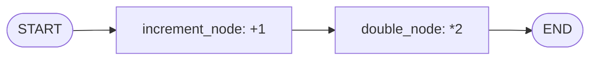
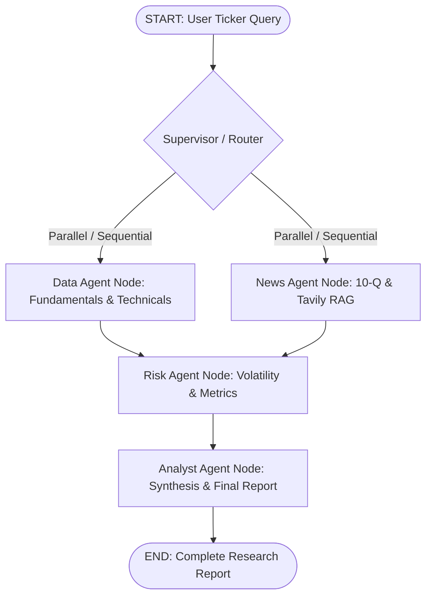

# LangGraph: State, Nodes, and Edges

> *"LangGraph turns complex agent interactions into a deterministic, debuggable state machine."*

---

## 1. What Problem Does LangGraph Solve?

In Phase 1 and Phase 2, we built tools, LLM clients, vector databases, and retrieval pipelines. But when multiple capabilities must collaborate:
- Data Agent must pull historical quotes and compute technicals.
- News Agent must retrieve recent SEC filings and financial news.
- Risk Agent must calculate drawdown and volatility.
- Analyst Agent must synthesize everything into a final research note.

If you wire this using ad-hoc `if/else` statements or single unstructured while-loops:
1. **State sharing becomes messy**: Variables get passed in arbitrary dicts or global variables.
2. **Failure recovery is fragile**: If one API call fails, the entire script halts or loses context.
3. **Execution paths are hard to reason about**: You cannot easily visualize, test, or branch the logic.

**LangGraph** solves this by formalizing agent systems as **Directed Graphs** (State Machines).

---

## 2. The Three Core Primitives

A LangGraph application is built from three concepts:

```
           ┌──────────────────────────────────────────────┐
           │                    STATE                     │
           │  Shared typed memory schema (e.g. TypedDict) │
           └──────────────────────┬───────────────────────┘
                                  │
                   ┌──────────────┴──────────────┐
                   ▼                             ▼
        ┌─────────────────────┐       ┌─────────────────────┐
        │       NODE 1        │       │       NODE 2        │
        │ (Python / Agent fn) │══Edge═▶ (Python / Agent fn) │
        │  Reads/updates state│       │  Reads/updates state│
        └─────────────────────┘       └─────────────────────┘
```

### 1. State: The Single Source of Truth
The **State** is a structured data schema (typically defined with Python's `TypedDict` or Pydantic) that flows through every part of the graph.
- Every node receives the current state as its argument.
- Every node returns a dictionary containing *only the keys it wants to update*.
- LangGraph applies these updates to produce the next state.

### 2. Nodes: Specialized Units of Work
A **Node** is simply a Python function (synchronous or asynchronous):
```python
def my_node(state: MyState) -> dict:
    # 1. Read what you need from state
    symbol = state["ticker"]
    
    # 2. Do the work (API call, computation, LLM prompt)
    data = fetch_market_data(symbol)
    
    # 3. Return ONLY the state updates
    return {"stock_data": data}
```
In StockSage Phase 3, each specialist agent (Data Agent, News Agent, Risk Agent, Analyst Agent) will be encapsulated as its own node.

### 3. Edges: Control Flow and Routing
An **Edge** defines transitions from one node to the next:
- **Standard Edges (`builder.add_edge("node_a", "node_b")`)**: Unconditionally routes from Node A to Node B.
- **Conditional Edges (`builder.add_conditional_edges(...)`)**: Inspects the current state and routes dynamically (e.g., if a tool returns an error, route to error recovery; otherwise route to the next analyst).
- **Entry & Exit Points (`START` and `END`)**: Define where execution begins and terminates.

---

## 3. Our Day 33 Minimal Graph (`src/graph/intro.py`)

To verify the mental model before adding complex financial agents, we built a two-node pipeline:



When invoked with `{"count": 5}`:
1. `START` hands `{"count": 5, "log": []}` to `increment_node`.
2. `increment_node` returns `{"count": 6, "log": ["increment_node: 5 -> 6"]}`.
3. LangGraph updates the state and passes it across the edge to `double_node`.
4. `double_node` returns `{"count": 12, "log": ["...", "double_node: 6 -> 12"]}`.
5. The edge terminates at `END`. Final output: `{"count": 12}`.

---

## 4. Looking Ahead: Multi-Agent Architecture for StockSage

This 2-node pattern directly scales into our full multi-agent financial platform:



Every agent interacts purely through the shared state schema (`StockSageState`), ensuring loose coupling and rigorous testability.
