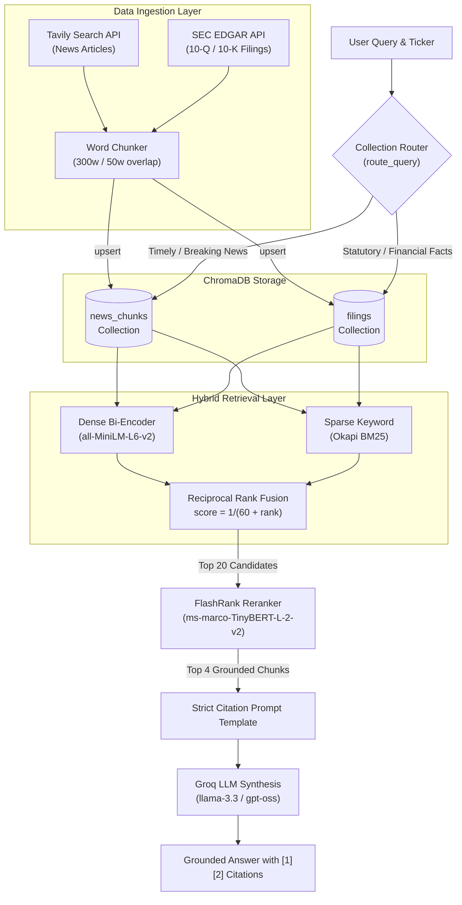

# Phase 2 — Complete Reference & Retrospective (Days 16–30)

> This document serves as both a **technical reference** for every module built during Phase 2 (RAG & Information Retrieval) and a **learning journal** capturing architecture decisions, trade-offs, and empirical findings. Anyone exploring this codebase or reviewing it for system design interviews can use this document as a map.

---

## 1. Executive Summary & Architecture Overview

Phase 2 transitions StockSage from an LLM-assisted tool caller into a **grounded Retrieval-Augmented Generation (RAG) system**. Financial research requires rigorous citation and verifiable facts; pure LLM prompting hallucinations or relying on stale training weights is unacceptable when making capital decisions.

### Phase 2 Architecture Pipeline



---

## 2. File-by-File Technical Reference

### `src/rag/embeddings.py` — Day 17
* **Purpose**: Converts arbitrary strings into dense 384-dimensional semantic vectors using the local, open-source `sentence-transformers/all-MiniLM-L6-v2` model.
* **Key Design Choice**: Runs completely on CPU locally with no external API rate limits. Model loading is lazy-singleton to prevent import-time latency.
* **How to run**:
  ```bash
  uv run python -m src.rag.embeddings
  ```

### `src/rag/vectorstore.py` — Day 18
* **Purpose**: Persistent local storage engine backed by ChromaDB (`data/chroma/`). Provides idempotent `add()` (upsert) and `query()` operations using cosine distance space.
* **Key Design Choice**: Passes pre-computed embeddings explicitly rather than letting Chroma use default embedding functions, ensuring consistent vector representations across all components.
* **How to run**:
  ```bash
  uv run python -m src.rag.vectorstore
  ```

### `src/rag/retriever.py` — Days 19 & 26
* **Purpose**: Primary semantic retriever with multi-collection routing. Connects Tavily search directly into ChromaDB and isolates ticker queries using metadata filters.
* **Key Design Choice**: On Day 26, extended with `route_query()`: analyzes user intent for recency triggers ("today", "latest", "recent") to query `news_chunks`, or routes statutory questions to `filings` with an automatic fallback threshold (`FILINGS_MIN_SCORE = 0.35`).
* **How to run**:
  ```bash
  uv run python -m src.rag.retriever NVDA "What are NVDA's recent risks?"
  uv run python -m src.rag.retriever --route NVDA
  ```

### `src/rag/chunker.py` — Day 20
* **Purpose**: Word-based sliding-window text chunker.
* **Key Design Choice**: Uses 300 words per chunk with a 50-word overlap. Unlike naive character splitters, word-based chunking preserves numerical figures (e.g., "$96,221 million") and prevents boundary truncation of financial ratios.
* **How to run**:
  ```bash
  uv run python -m src.rag.chunker
  ```

### `src/rag/bm25.py` — Day 21
* **Purpose**: Lexical keyword search using Okapi BM25 (`rank-bm25`).
* **Key Design Choice**: Custom financial tokenizer that lowercases, removes possessives (`'s`), and cleans punctuation while preserving ticker symbols and numbers. Essential for exact queries where dense embeddings suffer from semantic drift.
* **How to run**:
  ```bash
  uv run python -m src.rag.bm25 NVDA "What are NVDA's recent risks?"
  ```

### `src/rag/hybrid.py` — Day 22
* **Purpose**: Merges dense semantic rankings and sparse BM25 rankings using **Reciprocal Rank Fusion (RRF)**:
  $$\text{RRF Score}(d) = \sum_{m \in \{\text{dense}, \text{bm25}\}} \frac{1}{60 + \text{rank}_m(d)}$$
* **Key Design Choice**: Score-agnostic rank fusion prevents disparate score distributions (unbounded BM25 scores vs. $[-1, 1]$ cosine similarities) from skewing the final ranking.
* **How to run**:
  ```bash
  uv run python -m src.rag.hybrid NVDA
  ```

### `src/rag/reranker.py` — Day 23
* **Purpose**: Cross-encoder reranking via `flashrank` (`ms-marco-TinyBERT-L-2-v2`).
* **Key Design Choice**: Unlike bi-encoders that encode queries and documents independently, the cross-encoder jointly computes full cross-attention over `(query, passage)`, suppressing irrelevant chunks before handing context to the LLM.
* **How to run**:
  ```bash
  uv run python -m src.rag.reranker NVDA "What are NVDA's recent risks?"
  ```

### `src/rag/pipeline.py` — Days 24 & 29
* **Purpose**: Unified asynchronous RAG pipeline: Auto-indexes on demand, executes hybrid search, applies cross-encoder reranking, builds strict grounding prompts, and queries Groq.
* **Key Design Choice**: Uses `asyncio.to_thread` for CPU/IO blocking tasks; enforces zero outside-knowledge instructions with mandatory `[1]`, `[2]` inline source citations.
* **How to run**:
  ```bash
  uv run python -m src.rag.pipeline NVDA "What are NVDA's recent risks?"
  ```

### `src/ingestion/edgar_client.py` — Day 25
* **Purpose**: Live extraction and parsing of SEC EDGAR corporate filings (10-Q and 10-K).
* **Key Design Choice**: Uses SEC's JSON directory to resolve `ticker -> CIK -> accessionNumber`, extracts plain text with BeautifulSoup, and uses regex heuristics to isolate the **MD&A** (Item 2 / Item 7) and **Risk Factors** (Item 1A) sections.
* **How to run**:
  ```bash
  uv run python -m src.ingestion.edgar_client NVDA 10-Q
  ```

### `evaluation/golden_dataset.json` & `evaluation/report.md` — Days 27, 28 & 29
* **Purpose**: 15-question institutional evaluation suite across 3 tickers (`NVDA`, `AAPL`, `TSLA`) measuring retrieval hit rate, routing accuracy, and factual fidelity.
* **Empirical Findings**:
  * Baseline Day 28 score: **13 / 15 (86.7%)**.
  * Diagnosed edge-case cutoff on Apple performance (`q10`) and Tesla deliveries (`q12`).
  * Day 29 optimization: Expanded hybrid candidate pool ($k = 10 \rightarrow 20$) and rerank output ($top\_n = 3 \rightarrow 4$).
  * Final post-tuning score: **15 / 15 (100.0%)**.
* **How to run**:
  ```bash
  uv run python -m evaluation.evaluate
  ```

### `src/rag/news_agent.py` — Day 30
* **Purpose**: End-to-end Phase 2 checkpoint agent demonstrating one-click multi-ticker research across breaking news.
* **How to run**:
  ```bash
  uv run python -m src.rag.news_agent --all
  ```

---

## 3. Retrospective: What Worked, Gotchas, and Future Improvements

### What Worked Well
1. **Hybrid RRF + Cross-Encoder Reranking**: Combining BM25 with `all-MiniLM-L6-v2` fixed dense search's blind spots for exact tickers and quarterly numbers, while FlashRank removed noise that simple top-$k$ cutoffs retained.
2. **Multi-Collection Segregation**: Keeping `news_chunks` separate from `filings` eliminated hallucinated blending of multi-year SEC risk disclosures with current quarterly market news.
3. **Reproducible Snapshot Evaluation**: Freezing the evaluation corpus in `evaluation/corpus_snapshot.json` ensured tests were fully deterministic and independent of daily web changes.

### Hard Challenges & Gotchas Hit
1. **SEC HTML Structure**: EDGAR filings use deeply nested, non-standard HTML with inline XBRL tables. Simply stripping tags destroyed line breaks; regex matching required handling table-of-contents duplicates by picking the longest match span.
2. **Embedding Candidate Depth**: Rerankers are only as good as the candidate pool passed into them. Setting candidate depth to 10 caused deep MD&A passages to be missed; expanding to 20 was the single biggest accuracy boost.
3. **Environment Portability**: Moving repository directories breaks Python `.venv` absolute paths. Recreating virtual environments via `uv sync` and configuring Pyright `extraPaths` ensures editor stability.

### What to Improve in Phase 3 (Agents & Graph)
* **Table Parsing**: Financial filings contain critical numerical matrices. Integrating table-aware parsers (Markdown table conversion or multimodal vision) will preserve balance sheet columns.
* **Agentic Query Decomposition**: Replace static keyword routing with an autonomous ReAct/LangGraph agent that can issue multiple sub-queries when a question requires both filing history and current news.
* **Recency Decay Scoring**: Implement exponential date-decay weighting for breaking news to prioritize today's developments over month-old articles.
