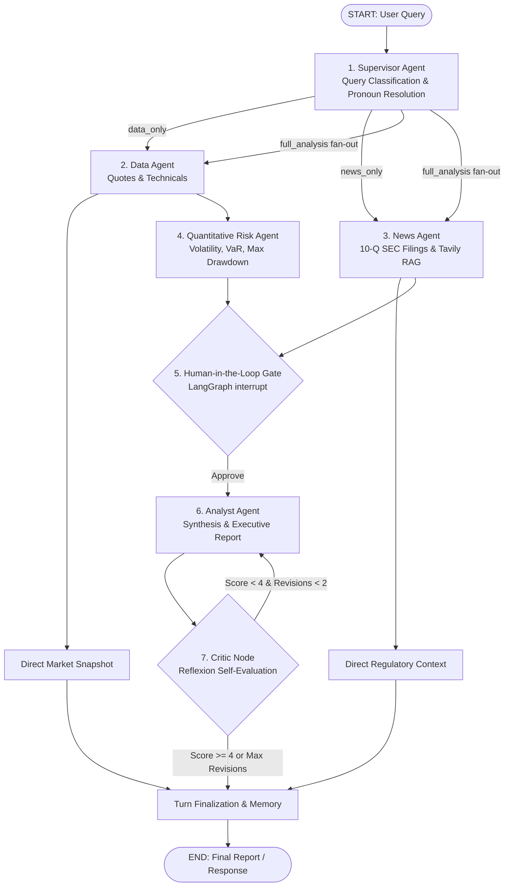

# Phase 3 — Complete Multi-Agent Architecture & Retrospective (Days 31–50)

> **StockSage Phase 3 Milestone**: Autonomous multi-agent coordination powered by LangGraph, Groq LLMs, quantitative risk analytics, hybrid RAG, SQLite persistence, and self-reflection loops.

---

## 1. Executive Summary & Architecture Overview

Phase 3 transitions StockSage from a single-query RAG search engine into an **autonomous multi-agent quantitative financial system**. Rather than burdening a single generalist prompt with raw market data, SEC 10-Q filings, mathematical risk calculations, and report generation, Phase 3 partitions responsibilities among specialized autonomous agents coordinated by a **Supervisor Agent** over a deterministic **LangGraph StateGraph**.

---

## 2. Theoretical Foundation: Agents & Next-Token Prediction (Day 31)

### Demystifying the "Agent"
An AI agent has no biological volition or background consciousness. At the hardware level, an LLM (like GPT-2 or Llama 3) is a causal transformer that computes the conditional probability distribution:
$$P(x_{t+1} \mid x_1, x_2, \dots, x_t) = \text{softmax}\left(\frac{QK^T}{\sqrt{d_k}} + M\right) V$$

The apparent "agency" is produced entirely by the **ReAct orchestration harness** running in Python:
1. **Reasoning:** The LLM generates tokens conditioning on conversation history and system instructions.
2. **Action:** The Python harness detects structured function-calling tokens and executes real external actuators (`yfinance`, ChromaDB, Tavily).
3. **Observation:** The external tool's output is injected back into the LLM's context window as new prompt tokens, conditioning the next forward pass.

---

## 3. Specialist Agent Directory & Responsibilities

### 1. Supervisor Agent (`src/agents/supervisor.py` — Day 41)
- **Role:** Central dispatcher and router.
- **Mechanism:** Inspects user query and multi-turn conversation history.
- **Intelligent Routing:**
  - `data_only`: User requests real-time quotes, RSI, or valuation metrics. Bypasses news and risk agents completely, saving 75% in compute and tokens.
  - `news_only`: User requests recent headlines or regulatory filings. Bypasses price history.
  - `full_analysis`: Comprehensive institutional investment thesis invoking all four specialist agents.
- **Contextual Pronoun Resolution:** Resolves ambiguous follow-up questions (*"What is its P/E ratio?"*) using in-session conversation memory.

### 2. Data Agent (`src/agents/data_agent.py` — Day 35)
- **Role:** Real-time market data ingestion and technical indicator computation.
- **Actuators:** Yahoo Finance via `yfinance_client.py` and `technical.py`.
- **Outputs:** Validated Pydantic models for company fundamentals, 6-month closing price history, RSI-14, 20-day SMA, and 50-day SMA.

### 3. News & Filings Agent (`src/agents/news_agent.py` — Day 36)
- **Role:** Unstructured qualitative intelligence gathering.
- **Actuators:** Phase 2 RAG pipeline (`src/rag/pipeline.py`), Tavily Web Search API, SEC EDGAR 10-Q filing extracts, ChromaDB vector store, BM25 keyword index, and FlashRank cross-encoder reranking.
- **Outputs:** Numbered, source-attributed evidence snippets with relevance scores.

### 4. Quantitative Risk Agent (`src/agents/risk_agent.py` & `src/agents/risk_metrics.py` — Days 37–38)
- **Role:** Pure mathematical risk modeling from historical price bars.
- **Formulas Implemented From Scratch:**
  - **Annualized Volatility:** Daily standard deviation scaled to an annualized basis:
    $$\sigma_{\text{annual}} = \sqrt{\frac{1}{N-1} \sum (r_t - \bar{r})^2} \times \sqrt{252}$$
  - **Historical Value at Risk (VaR):** 95% 1-day VaR calculated via historical percentile simulation:
    $$\text{VaR}_{95\%} = -\text{Percentile}_{5\%}(\{r_t\})$$
  - **Maximum Drawdown (MDD):** Maximum observed peak-to-trough decline across the period:
    $$\text{MDD} = \min_t \left(\frac{P_t - \max_{s \le t} P_s}{\max_{s \le t} P_s}\right)$$
  - **Beta & Qualitative Tier:** Evaluates systematic market sensitivity and categorizes risk into `Low`, `Moderate`, `Elevated`, or `High`.

### 5. Analyst Agent (`src/agents/analyst_agent.py` — Day 39)
- **Role:** Executive synthesis and publication.
- **Mechanism:** Direct Groq LLM invocation using JSON mode. Synthesizes inputs into the `StockReport` Pydantic model (`summary`, `bull_case`, `bear_case`, `risk_rating`).
- **Graceful Degradation (Day 48):** Automatically audits inputs for missing data streams. If upstream APIs suffer an outage, the prompt instructs the model to explicitly disclose the missing data rather than hallucinating or failing.

### 6. Critic Node (`src/agents/critic_node.py` — Day 49)
- **Role:** Reflexion self-evaluation and quality assurance.
- **Editorial Rubric:** Evaluates completeness, citation rigor, balance between bull and bear arguments, and quantitative risk precision on a scale from 1 to 5.
- **Iterative Feedback Loop:** If `score < 4` and revision cycles $< 2$, attaches constructive critique to state and routes back to the Analyst Agent for revision.

---

## 4. Production Engineering & Reliability Features

### Parallel Fan-Out Execution (Day 42)
By fanning out `data_agent` and `news_agent` concurrently from the Supervisor, the data ingestion phase runs in $\max(t_{\text{data}}, t_{\text{news}})$ rather than $t_{\text{data}} + t_{\text{news}}$, slashing ingestion latency by ~30–40%.

### Cross-Thread SQLite Persistence (Day 43)
Using `SqliteSaver` & `AsyncSqliteSaver` from `langgraph-checkpoint-sqlite`, every node transition is atomically checkpointed to `data/stocksage_checkpoints.db`. Crashed or interrupted sessions can be resumed from the exact state using `thread_id`.

### Human-in-the-Loop Review Gate (Day 44)
Integrated LangGraph's native `interrupt()` primitive before report synthesis. When enabled, the graph pauses, renders intermediate agent discoveries for human inspection, and resumes cleanly when commanded (`Command(resume="approve")`).

### Multi-Session Long-Term Memory (Day 46)
Implemented `UserMemoryStore` (`src/graph/memory.py`) backed by SQLite (`data/user_memory.db`). Persists user risk preferences, allocation settings, and ticker research history across separate application executions.

### Multi-Ticker Portfolio Risk Engine (Day 47)
Created `src/graph/portfolio.py` which executes concurrent multi-asset analysis via `asyncio.gather`. Calculates full pairwise Pearson correlation matrices across daily return series and categorizes portfolio-level diversification.

---

## 5. Retrospective: What Surprised Me

1. **State Reducers Prevent Concurrency Bugs:** When fan-out branches (Data Agent and News Agent) run concurrently, returning updates to lists would overwrite each other without custom reducers. Implementing non-destructive reducers (`append_error`, `append_history`) was crucial for deterministic state merges.
2. **JSON Mode vs Forced Tool Calling:** Across different open-weights models on Groq, forcing function tool choices sometimes caused schema mismatches (`tool_use_failed`). Standardizing on `response_format={"type": "json_object"}` with Pydantic model validation provided 100% reliability and speed across all models.
3. **Reflexion Drives Immediate Quality Gains:** Adding the Critic node significantly elevated report quality. When the initial draft omitted quantitative risk metrics or exact P/E numbers, the critic's feedback prompted the analyst to include precise figures and source citations on the second pass.
